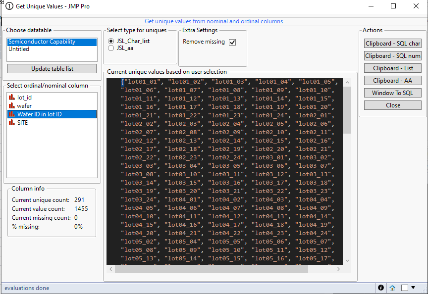
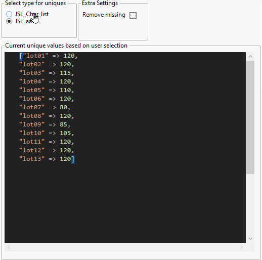

# Get Unique Value

| [Description](#description) | [Usage](#usage) | [Execution](#execution) | [Possible future features](#possible-future-features) |

## Description

Tool to get unique values from Ordinal/Nominal columns. Show value some column info, values in script box (values are limited and warning will be shown when some values are hidden, they will still be copied with buttons). Also provides buttons which can be used to set values to clipboard.
If tool is started without datatable open, list of values can be copy-pasted to get them as SQL in type format.

## Usage

Select column to see unique values and use buttons to copy them to clipboard in different formats. 

### Startup with JSL_Char_list

### Startup with JSL_aa

## Options
* Type selection
    * JSL_Char_list - will show values as JMP List
    * JSL_aa - will show values as JMP Associative Array with value being count of unique values
* Remove Missing
  * Hides missing values from window

## Buttons

* Clipboard - SQL char
  * Copies values from selected column to clipboard as sql in with characters: `('lot01_01', 'lot02_02')`
* Clipboard - SQL num
  * Copies values from selected column to clipboard as sql in with numbers: `(123, 456, 567)`
* Clipboard - List
  * Copies values from selected column to clipboard as JMP List: `{"lot01_01", "lot01_02"}`
* Clipboard - AA
  * Copies values from selected column to clipboard as JMP Associative array `["lot01" => 120, "lot02" => 120]`
* Window To SQL
  * Copies values from seen script editor box as SQL. Can be used for example to copy paste values from Excel to window to get SQL in formatted string

## Execution
NA

## Possible future features
NA